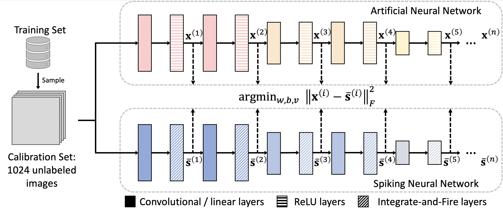

# SNN_Calibration
**Pytorch Implementation of Spiking Neural Networks Calibration, ICML 2021**

Paper Version 1: [[PMLR]](http://proceedings.mlr.press/v139/li21d/li21d.pdf), [[arXiv]](https://arxiv.org/pdf/2106.06984.pdf).

Paper Version 2: [[arXiv]](https://arxiv.org/pdf/2205.10121.pdf).

When converting ANNs to SNNs, conventional methods ensure the minimization in parameter space, while we focus on the minimization in network output space:



Feature Comparison of SNN calibration:

| Features                | SNN Direct Training                | ANN-SNN Conversion | SNN Calibration |
| ----------------------- | ---------------------------------- | ------------------ | --------------- |
| Accuracy (T<100​)        | High                               | Low                | High            |
| Scalability to ImageNet | Tiny                               | Large              | Large           |
| Training Speed          | Slow                               | Fast               | Fast            |
| # Required Data         | Full-set <br />(1.2M For ImageNet) | ~1000              | ~1000           |
| Inference Speed         | Fast                               | Slow               | Fast            |


### Requirements

Pytorch 1.8

For ImageNet experiments, please be sure that you can initialize distributed environments

For CIFAR experiments, one GPU would suffice. 

## Update (May 31, 2022): New version of the code

We released a new version of the paper, and will update the code to match the experiments with that paper. 


## Update (Jan 14, 2022): ImageNet experiments

For imagenet experiments, please first download the checkpoints from [Google Drive](https://drive.google.com/drive/folders/1vwNx4xTF6EG_Brbu-6mGkgC2HcfgtBTe?usp=sharing).

We recommend initializing distributed learning environments, and utlizing multi-GPU calibration.

For reproducibility, 8 GPUs are per run and distributed environments are highly encouraged. 

For example:

```bash
python ImageNet/main_imagenet.py --arch res34 --T 32 --usebn --calib light --dpath PATH/TO/DATA
```


### Pre-training ANN on CIFAR10&100

Train an ANN model with `main_train.py`

`python CIFAR/main_train.py --dataset CIFAR10 --arch VGG16 --dpath PATH/TO/DATA --usebn `

Pre-trained results:

| Dataset  | Model     | Random Seed | Accuracy |
| -------- | --------- | ----------- | -------- |
| CIFAR10  | VGG16     | 1000        | 95.76    |
| CIFAR10  | ResNet-20 | 1000        | 95.68    |
| CIFAR100 | VGG16     | 1000        | 77.98    |
| CIFAR100 | ResNet-20 | 1000        | 76.52    |


### SNN Calibration on CIFAR10&100

Calibrate an SNN with `main_calibration.py`.

`python CIFAR/main_calibration.py --dataset CIFAR10 --arch VGG16 --T 16 --usebn --calib advanced --dpath PATH/TO/DATA `

`--T` is the time step, `--calib`  is the calibration method, please use *none, light, advanced* for experiments.  

The calibration will run 5 times, and return the mean accuracy as well as the standard deviation. 

Example results:

| Architecture | Dataset   | T    | Random Seed | Calibration | Mean Acc | Std. |
| ------------ | -------- | ---- | ----------- | ----------- | -------- | ---- |
| VGG16        | CIFAR10  | 16   | 1000        | None        | 64.52    | 4.12 |
| VGG16        | CIFAR10  | 16   | 1000        | Light       | 93.30    | 0.08 |
| VGG16        | CIFAR10  | 16   | 1000        | Advanced    | 93.65    | 0.25 |
| ResNet-20    | CIFAR10  | 16   | 1000        | None        | 67.88    | 3.63 |
| ResNet-20    | CIFAR10  | 16   | 1000        | Light       | 93.89    | 0.20 |
| ResNet-20    | CIFAR10  | 16   | 1000        | Advanced    | 94.33    | 0.12 |
| VGG16        | CIFAR100 | 16   | 1000        | None        | 2.69     | 0.76 |
| VGG16        | CIFAR100 | 16   | 1000        | Light       | 65.26    | 0.99 |
| VGG16        | CIFAR100 | 16   | 1000        | Advanced    | 70.91    | 0.65 |
| ResNet-20    | CIFAR100 | 16   | 1000        | None        | 39.27    | 2.85 |
| ResNet-20    | CIFAR100 | 16   | 1000        | Light       | 73.89    | 0.15 |
| ResNet-20    | CIFAR100 | 16   | 1000        | Advanced    | 74.48    | 0.16 |


---
If you feel this repo helps you, please consider citing the following articles:

```
@article{li2022converting,
  title={Converting Artificial Neural Networks to Spiking Neural Networks via Parameter Calibration},
  author={Li, Yuhang and Deng, Shikuang and Dong, Xin and Gu, Shi},
  journal={arXiv preprint arXiv:2205.10121},
  year={2022}
}

@inproceedings{li2021free,
  title={A free lunch from ANN: Towards efficient, accurate spiking neural networks calibration},
  author={Li, Yuhang and Deng, Shikuang and Dong, Xin and Gong, Ruihao and Gu, Shi},
  booktitle={International Conference on Machine Learning},
  pages={6316--6325},
  year={2021},
  organization={PMLR}
}
```

